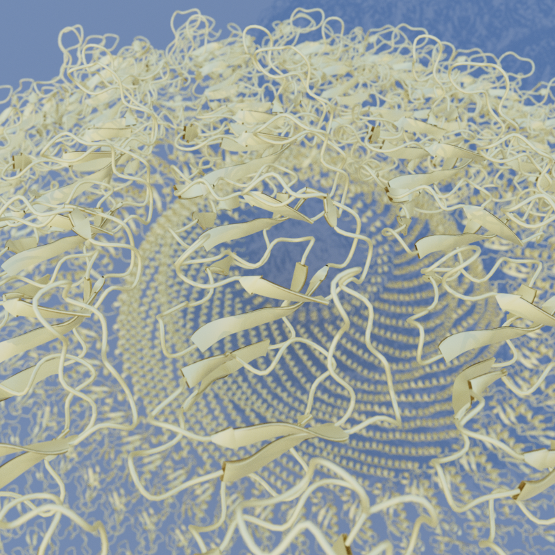

# Hikari.jl

GPU-accelerated physically-based spectral path tracer for Julia, built on [KernelAbstractions.jl](https://github.com/JuliaGPU/KernelAbstractions.jl). Used as the ray tracing backend for [Makie.jl](https://github.com/MakieOrg/Makie.jl) via [RayMakie](https://github.com/MakieOrg/Makie.jl).

<p align="center">
  
  <br>
  <em>BOMEX LES cloud field with volumetric path tracing</em>
</p>

## Gallery

All renders produced with Hikari via RayMakie. Demo source code at [SimonDanisch/RayDemo](https://github.com/SimonDanisch/RayDemo).

|   |   |
|:-:|:-:|
|  |  |
| Terrain with volumetric clouds | Black hole with gravitational lensing |
|  |  |
| Protein structure (glass) | Protein structure (gold conductor) |
|  |  |
| CMS particle detector ([Geant4.jl](https://github.com/JuliaHEP/Geant4.jl)) | HL-20 spacecraft with volumetric exhaust |
|  |  |
| Oil palm ([PlantGeom.jl](https://github.com/VEZY/PlantGeom.jl)) | Stanford bunny cloud (NanoVDB) |

## Features

- **GPU-accelerated**: Runs on AMD (ROCm) and NVIDIA (CUDA) GPUs via KernelAbstractions.jl
- **Spectral rendering**: Hero-wavelength spectral path tracing with CIE XYZ color matching
- **Volumetric path tracing**: Delta tracking with null scattering for participating media (fog, smoke, clouds)
- **NanoVDB support**: Sparse volumetric data for large-scale cloud/smoke rendering
- **pbrt-v4 based**: Physically-based materials and light transport ported from [pbrt-v4](https://github.com/mmp/pbrt-v4)
- **Material system**: Glass, conductor (measured spectral data), coated diffuse, thin dielectric, diffuse transmission, and more
- **BVH light sampling**: Spatially-aware importance sampling for many-light scenes
- **Makie integration**: Drop-in ray tracing backend for the Makie ecosystem via RayMakie

## Related packages

| Package | Description |
|---------|-------------|
| [Raycore.jl](https://github.com/JuliaGeometry/Raycore.jl) | BVH acceleration and ray-scene intersection |
| [RayMakie](https://github.com/MakieOrg/Makie.jl) | Makie backend that connects Hikari to the Makie plotting ecosystem |
| [RayDemo](https://github.com/SimonDanisch/RayDemo) | Demo scenes and rendered gallery |

## Install

```julia
] add Hikari
```

## Quick start

Using Hikari through RayMakie:

```julia
using GLMakie, RayMakie, Hikari

# Activate the ray tracing backend
backend = Hikari.KernelAbstractions.CPU() # Or e.g. CUDA.CUDABackend() or AMDGPU.ROCBackend()
RayMakie.activate!(; device=backend)

# Build a scene with Makie
scene = Scene(; size=(800, 800), lights=[Makie.SunSkyLight(Vec3f(1, 2, 9); intensity=1f0, turbidity=3f0, ground_enabled=false)])
cam3d!(scene)

# Add geometry with physically-based materials
mesh!(scene, Sphere(Point3f(0), 1f0); material=Hikari.GlassMaterial(index=1.5))
mesh!(scene, Rect3f(Point3f(-2, -2, -1), Vec3f(4, 4, 0.01));
    material=Hikari.Gold(roughness=0.01f0))

# Render
integrator = Hikari.VolPath(samples=256, max_depth=12)
img = Makie.colorbuffer(scene; integrator=integrator)
```

## Acknowledgements

Originally developed as [Trace.jl](https://github.com/pxl-th/Trace.jl) by [Anton Smirnov](https://github.com/pxl-th). Rewritten with GPU support, spectral rendering, and a pbrt-v4 based volumetric path tracer.
